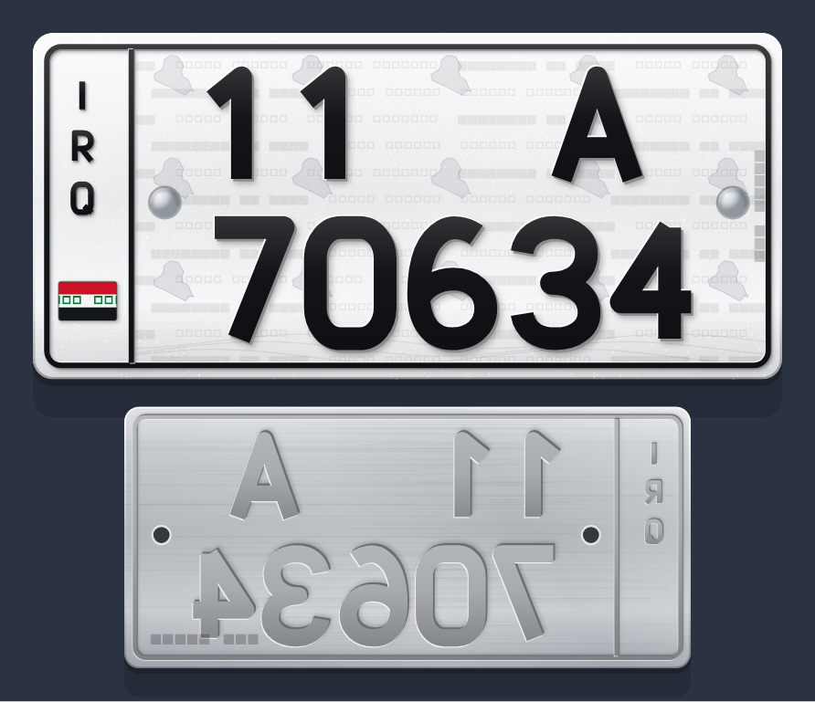
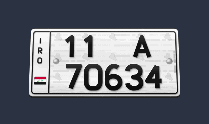
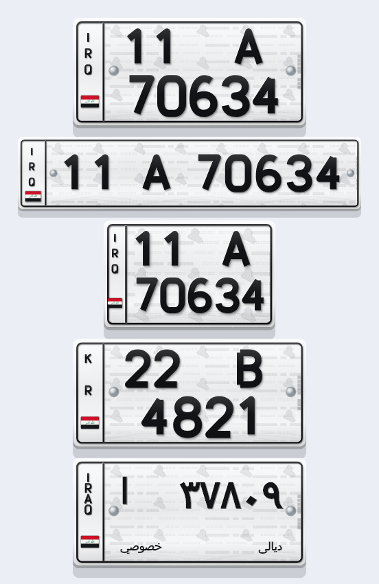

<p align="center">
  
</p>

<p align="center">
  <strong>لوحات المركبات العراقية لتطبيقات Flutter</strong><br>
  Photoreal Iraqi vehicle registration plates for Flutter — cars, motorcycles,
  the European blank and the legacy Arabic blank — with the full governorate,
  category and series-letter data model behind them.
</p>

<p align="center">
  <a href="https://pub.dev/packages/iraqi_license_plate"></a>
  <a href="LICENSE"></a>
  
  <a href="https://github.com/Abojawdat"></a>
</p>

Every plate is drawn by a single `CustomPainter` against the real blank
dimensions in millimetres. No images, no fonts, no network, no plugins. The
package depends on nothing but Flutter itself, so it drops into any project and
runs on all six platforms.



<p align="center"><em>Not a picture — every pixel above is painted at run time.<br>
The reverse is the same registration stamped through the aluminium: mirrored,
concave, in bare unpainted metal.</em></p>

---

## Install

```sh
flutter pub add iraqi_license_plate
```

Or by hand:

```yaml
dependencies:
  iraqi_license_plate: ^0.1.0
```

Then:

```dart
import 'package:iraqi_license_plate/iraqi_license_plate.dart';
```

---

## Quick start

```dart
IraqiLicensePlate(
  plate: IraqiPlate.tryParse('11 A 70634')!,
  width: 220,
)
```

That is the whole API for the common case. `width` is in logical pixels; the
height comes from the blank's real aspect ratio.

> **Size it by width, never by height.** The widget is a fixed-aspect object.
> Putting it in a `SizedBox(height: …)` or an `Expanded` on the cross axis will
> not do what you want.

### From your API

```dart
final plate = IraqiPlate(
  governorate: IraqGovernorate.fromCode(json['gov_code'] as int)!,
  letter: json['letter'] as String,      // 'A'
  serial: json['serial'] as String,      // '70634'
  category: PlateCategory.publicHire,    // taxi
);

if (!plate.isValid) {
  debugPrint(plate.validationError);     // human-readable reason
}
```

`IraqiPlate.tryParse` accepts `11 A 70634`, `11A70634`, `11-A-70634`, and
Eastern-Arabic digits (`١١ A ٧٠٦٣٤`). It returns `null` rather than throwing, so
you can fall back to showing the raw string when a backend sends something odd.

<p align="center">
  
</p>

---

## Recipes

### A driver card, straight off your API

The common case. Your backend sends a registration string; `tryParse` returns
`null` rather than throwing, so a malformed record degrades to plain text
instead of crashing the screen.

```dart
Widget plateFor(Map<String, dynamic> driver) {
  final plate = IraqiPlate.tryParse(
    driver['plate_number'] as String,          // '11 A 70634' or '١١ A ٧٠٦٣٤'
    category: PlateCategory.publicHire,        // a taxi
  );

  if (plate == null) {
    return Text(driver['plate_number'] as String);
  }
  return IraqiLicensePlate(plate: plate, width: 160);
}
```

### In a list

Turn the security print off. Below ~90 px the painter skips it anyway, but at
list sizes this is the cheapest win available.

```dart
ListView.builder(
  itemCount: drivers.length,
  itemBuilder: (context, i) => ListTile(
    leading: IraqiLicensePlate(
      plate: drivers[i].plate,
      width: 96,
      showShadow: false,
      showSecurityPrint: false,
    ),
    title: Text(drivers[i].name),
  ),
)
```

### Validating what a user typed

`validationError` returns a human-readable reason instead of throwing, so it
drops straight into a form.

```dart
TextFormField(
  decoration: const InputDecoration(labelText: 'رقم اللوحة'),
  validator: (value) =>
      IraqiPlate.tryParse(value ?? '')?.validationError
      ?? 'Enter a plate like 11 A 70634',
)
```

### Building a plate by hand

```dart
const plate = IraqiPlate(
  governorate: IraqGovernorate.basra,
  letter: 'B',
  serial: '4821',
  category: PlateCategory.cargo,               // yellow band
  format: PlateFormat.modernLong,              // 520×110 European blank
);
```

---

## The 3D viewer

<p align="center">
  
</p>

```dart
PlateViewer3D(plate: plate, width: 280)
```

- **drag** — rotate on both axes
- **flick** — spin, with friction
- **double-tap** — flip to the reverse
- **long-press** — glide back to square on

The reverse is not a placeholder. The registration is *stamped* through the
aluminium, so the back shows the same characters mirrored and **concave**, in
bare unpainted metal, with the rivet holes showing through and no colour band,
no sheeting and no flag. Between the two faces sits a stack of thin slab layers,
so at a glancing angle you see the cut edge of the metal.

Use it for a showcase or a "verify the vehicle" screen — not inside a list.

---

## The built-in explorer

```dart
Navigator.of(context).push(
  MaterialPageRoute(builder: (_) => const PlateGalleryScreen()),
);
```

Browse every format, category, governorate and letter, edit the serial live,
and see the size ladder. Pure Material widgets, so it picks up your `Theme` and
works in light or dark. `example/` is nothing but this screen.

---

## What the plate system actually is

Worth reading once — it is why several parameters exist.

Two systems are on the road at the same time. The current one was issued in the
Kurdistan Region from **April 2022** and across the rest of Iraq from
**June 2024**: Latin letters, Western digits, `IRQ` (or `KR`) down the side
band, and the governorate as a two-digit code instead of its name. The plate it
replaced — Eastern-Arabic digits, an Arabic series letter, and the governorate
and category spelled out in Arabic along the bottom — is still valid and still
very common.

### Format → blank



| `PlateFormat`  | Blank      | Notes                                        |
| -------------- | ---------- | -------------------------------------------- |
| `modernShort`  | 335×155 mm | The ordinary car plate. **Default.**         |
| `modernLong`   | 520×110 mm | Standard European size, one row.             |
| `motorcycle`   | 200×125 mm | Shorter and squarer, narrower band, no rivets |
| `legacy`       | 335×155 mm | Pre-2024 Arabic plate.                       |

### Registration

`GG X NNNNN` — governorate code, series letter, serial.

The series letter is **not** a vehicle type. Letters are handed out
sequentially as blocks fill up. The one rule worth knowing: registrations
carried over from the old system with five or fewer digits all took the letter
**`A`**, which is why so many plates on the road read `A`.

### Governorate codes

| | | | |
|-|-|-|-|
| 11 Baghdad | 12 Nineveh | 13 Maysan | 14 Basra |
| 15 Al Anbar | 16 Al-Qadisiyyah | 17 Muthanna | 18 Babil |
| 19 Karbala | 20 Diyala | 21 Sulaymaniyah ᴋʀ | 22 Erbil ᴋʀ |
| 23 Halabja ᴋʀ | 24 Duhok ᴋʀ | 25 Kirkuk | 26 Saladin |
| 27 Dhi Qar | 28 Najaf | 29 Wasit | |

The four Kurdistan Region governorates automatically switch the band from `IRQ`
to `KR`. You do not set that — it follows from the governorate.

### Categories

The category is carried by the **colour of the side band**, not by the whole
plate. A taxi plate is a white plate with a red band.

<p align="center">
  
</p>

| `PlateCategory` | Band | Arabic | Meaning |
| --------------- | ---- | ------ | ------- |
| `private` | none (bare metal) | خصوصي | Privately owned cars. Default. |
| `publicHire` | red | أجرة | Taxis, buses, anything carrying fares |
| `government` | blue | حكومية | State-owned |
| `cargo` | yellow | حمل | Trucks, tractors, cranes |
| `agricultural` | green | زراعي | Farm and construction machinery |
| `temporary` | orange | مؤقت | Customs clearance, short-lived |
| `security` | black (whole plate) | مكافحة الإرهاب | Counter Terrorism Service |
| `defence` | green (whole plate) | الدفاع | Ministry of Defence |

`PlateCategory.rideEligible` is the subset a passenger could plausibly be picked
up in (`private`, `publicHire`) — handy for ride-hailing validation.

### Legacy series letters

`PlateSeries` maps the 17 Arabic letters of the old system to their Latin
equivalents: ا→A، ب→B، ج→J، د→D، ر→R، س→S، ط→T، ف→F، ك→K، م→M، ن→N، هـ→H،
ى→E، ق→Q، ل→L، و→W، ز→Z. `PlateSeries.fromLatin('B')` goes the other way.

---

## API reference

### `IraqiLicensePlate`

| Parameter | Default | What it does |
| --------- | ------- | ------------ |
| `plate` | required | The registration to draw |
| `width` | `220` | Logical pixels. Height is derived. |
| `showShadow` | `true` | Drop shadow. Off when it sits on an elevated surface. |
| `showSecurityPrint` | `true` | Micro-print, watermarks, guilloche |
| `tiltDegrees` | `0` | Static Y rotation with perspective |
| `face` | `PlateFace.front` | Front or the concave bare-metal reverse |

### `IraqiPlate`

`governorate` · `letter` · `serial` · `category` · `format`

- `formatted` → `'11 A 70634'`
- `bandText` → `'IRQ'` or `'KR'`
- `region` → `PlateRegion.federal` / `.kurdistan`
- `isValid` / `validationError`
- `serialArabicDigits` → `'٧٠٦٣٤'`, `letterArabic` → `'ب'`
- `copyWith(...)`, `tryParse(...)`, `IraqiPlate.reference`
- `IraqiPlate.toArabicDigits` / `.fromArabicDigits` (handles the Persian block
  too — plenty of Iraqi keyboards emit it)

---

## How it is built, and why it looks right

Worth knowing before you change anything.

**Everything is in millimetres.** The painter works against the real blank and
scales to the widget at paint time, so bolt spacing, band width and cap heights
are traceable to the physical plate rather than to a screen percentage. That is
what makes it correct at *any* size instead of only at the one it was tuned for.

**The relief is four layers, not a drop shadow.** Each character is drawn four
times from the same stroked path at sub-millimetre offsets: the shadow it casts
on the sheeting, the extruded wall turned away from the light, the top-left edge
catching the light, then the painted face with a slight vertical grade. A flat
fill with a shadow underneath does not read as stamped metal; this does. On the
reverse every offset flips sign and the lit wall swaps corners, which is all it
takes to turn a raised character into a recessed one.

**The typeface is vector, not a font.** Iraqi plates are stamped in a
DIN-1451-derived face — monolinear, flat terminals, squared bowls. No font you
are likely to bundle looks like that. `PlateTypeface` holds `0–9` and `A–Z` as
centre-line skeletons stroked at a fixed weight, on a grid whose proportions
(0.58 ink width, 0.17 stroke, both relative to cap height) were measured off a
photograph of a real Baghdad plate.

**Texture is what sells it.** Retroreflective glass-bead speckle, a diagonal
specular sweep, tiled `REPUBLIC OF IRAQ / جمهورية العراق / كۆماری عێراق`
micro-printing, repeated map-of-Iraq watermarks projected from the country's
real border coordinates, a guilloche wave, the vertical die stamp by the right
edge, and metallic rivets. Below ~90 px wide the security layer is skipped
automatically so small plates stay crisp instead of turning to mush.

**The band tint stops at the frame.** On a real plate the colour is printed on
the sheeting and the sheeting ends at the raised black border, so the tint is
clipped to the frame's inner rounded rect. Letting it run to the plate edge
merges the band with the rolled rim and the border stops reading as a border.

---

## Gotchas

- **Size by width.** Repeating it because it is the one that bites.
- **RTL.** The widget pins itself to `TextDirection.ltr` internally. A plate is
  a physical object and is never mirrored, even in an RTL app.
- **`PlateViewer3D` in a scrolling list.** It claims vertical drags, which will
  fight the scrollable. Put it in a fixed header, not mid-list.
- **Repaints.** The painter is `isComplex: true` / `willChange: false` and only
  repaints when the plate actually changes. If you animate it every frame (the
  3D viewer does), keep it to one on screen.
- **Legacy Arabic text needs a font with Arabic coverage.** The modern formats
  are pure vector and need nothing; the `legacy` blank and the flag's takbir
  render through `TextPainter` and fall back to the platform font.
- **Invalid input degrades, it does not throw.** A serial too long for the field
  is shrunk to fit rather than allowed to bleed over the frame, so a bad plate
  looks wrong rather than breaking the layout.

---

## Sources

- [Vehicle registration plates of Iraq — Wikipedia](https://en.wikipedia.org/wiki/Vehicle_registration_plates_of_Iraq)
- [Iraq (IRQ) license plates — matriculasdelmundo](https://matriculasdelmundo.com/en/irak.html)
- [License plates of Iraq — Wikimedia Commons](https://commons.wikimedia.org/wiki/Category:License_plates_of_Iraq)

Colour and layout details were cross-checked against a photograph of a current
Baghdad plate (`11 A 70634`), kept in the code as `IraqiPlate.reference`.

---

## Regenerating the images

Every picture in this README is produced by the package itself — nothing here
is a mockup or a photograph.

```sh
./tool/render_all.sh     # the stills    → render/*.png
./tool/render_spin.sh    # the spin      → render/06_spin.gif
python3 tool/render_art.py  # the diagrams → art/*.svg
```

Both scripts launch one `flutter test` process per image, which is slower than
it looks like it should be and is deliberate: a test process wedges on its
second call to `RenderRepaintBoundary.toImage`, so each one renders a single
frame and exits.

The scripts find a system font with Arabic coverage automatically, so the
legacy blank renders its glyphs instead of empty boxes; override it with
`PLATE_RENDER_FONT`, and raise the still resolution with `PLATE_RENDER_SCALE=2`.
The GIF is encoded by `tool/assemble_gif.dart` in pure Dart — no ffmpeg, and no
dependency added to the package.

The diagrams in `art/` are the one exception to "rendered by the package": they
are SVG, so they can carry type and labels a widget cannot, and they animate on
GitHub without a video. They are not drawings of a plate from memory —
`tool/render_art.py` lays the glyphs out with the same metrics as
`PlateTypeface` and stacks the same four relief layers as `_emboss`, in the same
millimetre space as `_PlateSpec`, so the diagrams cannot quietly drift away from
what the painter puts on screen. It has no dependencies.

---

## Contributing

Issues and pull requests are welcome, in Arabic or English —
[github.com/Abojawdat/plate-number-service](https://github.com/Abojawdat/plate-number-service/issues).

Corrections to the plate data are especially welcome. Iraq is running two
registration systems at once and the published sources disagree with each
other; if a plate on your street does not match what this package draws, open
an issue with a photo.

```sh
flutter test          # the unit suite — fast, no rendering
flutter analyze
dart format .
```

### Branches

| Branch | What it is |
| ------ | ---------- |
| `dev`  | Where the work happens. CI runs on every push. Open pull requests here. |
| `main` | Released code only. It receives a merge from `dev` and nothing else. |

A merge into `main` does not publish anything on its own. Releases are cut by
tagging, so that a merge made in error stays cheap to undo while a publish —
which can be retracted for seven days and never deleted — takes a deliberate
second step:

```sh
git checkout main && git merge dev
git tag v0.1.0 && git push origin main --tags
```

The tag has to match `version:` in `pubspec.yaml`; CI refuses the publish if it
does not.

---

## Author

Built by **Mohammad Othman (Abojawdat)** — [github.com/Abojawdat](https://github.com/Abojawdat).

Made in Iraq, for the developers building here. If it saved you a week of
CustomPainter work, a ⭐ on the
[repo](https://github.com/Abojawdat/plate-number-service) is appreciated.

## Licence

MIT — see [LICENSE](LICENSE). Free for commercial use; attribution is not
required, but always welcome.
